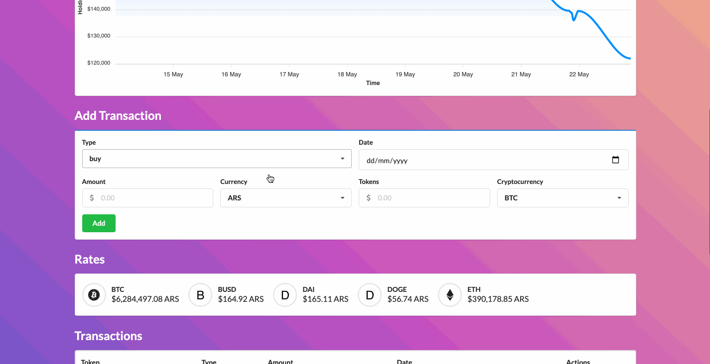

# CoinPortfolio
An excuse to learn Phoenix Framework and also a web app to keep track of your
cryptocurrency spend and earnings



## Requirements 

- gulp
- semantic-ui installed on static/semantic/
- A [CoinMarketCap](https://pro.coinmarketcap.com/) API key set as an env variable `CMC_API_KEY=your-api-key`
- An [Exchange Rates](https://exchangerate-api.com) API key set as an env variable `EXCHANGE_RATE_API_KEY=another-api-key`

## Configuration
In `config.exs` you can set the `:accepted_currencies` and `:accepted_tokens` that will be pulled from both APIs
``` elixir
# Currencies and Tokens
config :coin_portfolio,
  accepted_tokens: ["BTC", "ETH", "DOGE", "DAI"],
  accepted_currencies: ["ARS", "USD", "EUR"]
```

To start your Phoenix server:

  * Install dependencies with `mix deps.get`
  * Create and migrate your database with `mix ecto.setup`
  * Install Node.js dependencies with `npm install` inside the `assets` directory
  * Start Phoenix endpoint with `mix phx.server`

Now you can visit [`localhost:4000`](http://localhost:4000) from your browser.

Ready to run in production? Please [check our deployment guides](https://hexdocs.pm/phoenix/deployment.html).

## Learn more

  * Official website: https://www.phoenixframework.org/
  * Guides: https://hexdocs.pm/phoenix/overview.html
  * Docs: https://hexdocs.pm/phoenix
  * Forum: https://elixirforum.com/c/phoenix-forum
  * Source: https://github.com/phoenixframework/phoenix
